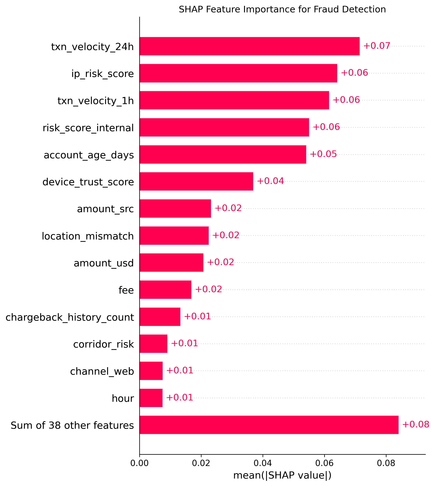
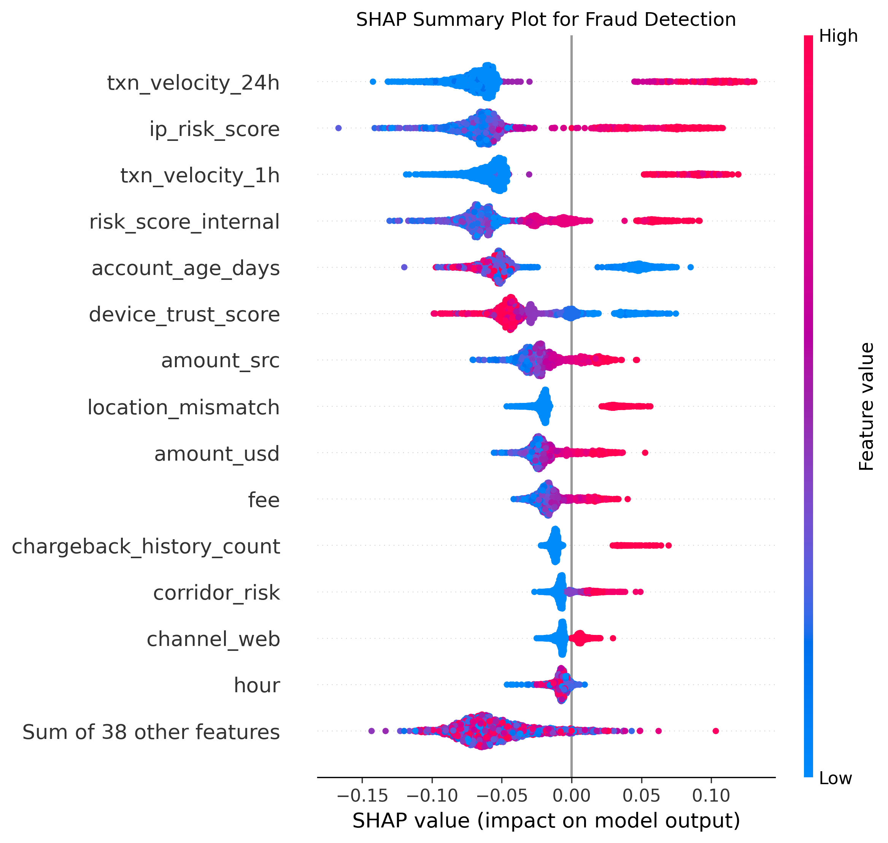

Fraud Detection Using Machine Learning, SHAP, FastAPI and Docker

Content
Project Overview
Project Workflow
Dataset and Preprocessing
Machine Learning Models
Model Performance Comparison
RandomizedSearchCV
GridSearchCV
Threshold Optimisation
SHAP Model Explainability
Individual Fraud Explanation
FastAPI Deployment
Docker Containerisation
Project Structure
Technologies Used
Key Insights
Conclusion
Future Improvements

Project Overview

This project develops an end-to-end machine learning system for detecting fraudulent financial transactions.

The workflow covers data preprocessing, exploratory analysis, feature engineering, model development, hyperparameter optimisation, threshold tuning, model explainability using SHAP, API deployment with FastAPI, and containerisation using Docker.

The overall objective is to develop an accurate and explainable fraud detection system that can identify suspicious transactions while minimising unnecessary fraud alerts.

Project Workflow

The project followed the sequence below:

Import Libraries
        ↓
Load Dataset
        ↓
Data Inspection
        ↓
Data Cleaning
        ↓
Exploratory Data Analysis
        ↓
Feature Engineering
        ↓
Encoding and Preprocessing
        ↓
Train/Test Split
        ↓
Logistic Regression
        ↓
Random Forest
        ↓
RandomizedSearchCV
        ↓
GridSearchCV
        ↓
Threshold Optimisation
        ↓
Final Model Selection
        ↓
SHAP Explainability
        ↓
FastAPI Deployment
        ↓
Docker Containerisation
Dataset and Preprocessing

The final modelling dataset contained:

11,335 observations
52 predictor features
Target variable: is_fraud
Training set: 9,068 observations
Test set: 2,267 observations

Training class distribution:

Class	Number
Legitimate transactions (0)	8,272
Fraudulent transactions (1)	796

The dataset was therefore imbalanced, with fraudulent transactions representing the minority class.

Data preprocessing included:

Missing-value treatment
Duplicate and inconsistent record handling
Date/time preprocessing
Categorical encoding
Feature engineering
Numeric preprocessing
Stratified train/test splitting

Machine Learning Models

Two main classification algorithms were initially evaluated:

Logistic Regression
Random Forest Classifier
Model Performance Comparison
Model	Accuracy	Precision (Fraud)	Recall (Fraud)	F1-score (Fraud)
Logistic Regression	0.9500	0.7000	0.8300	0.7600
Baseline Random Forest	0.9800	0.9900	0.8000	0.8900
RandomizedSearchCV Random Forest	0.9819	0.9938	0.7990	0.8858
GridSearchCV Random Forest	0.9819	0.9938	0.7990	0.8858

Model Interpretation

Logistic Regression achieved slightly higher fraud recall, identifying approximately 83% of fraudulent transactions. However, its lower precision of 70% means it produced substantially more false fraud alerts.

Random Forest demonstrated superior overall performance. It achieved approximately 98% accuracy, 99% fraud precision, and an F1-score close to 89%.

The model therefore provided a substantially better balance between fraud identification and avoidance of false positives.

Hyperparameter Optimisation
RandomizedSearchCV

RandomizedSearchCV was first used to explore a broad Random Forest hyperparameter space.

The best model identified approximately the following parameters:

criterion = entropy
max_depth = 20
min_samples_leaf = 2
min_samples_split = 6
n_estimators = 379
class_weight = balanced

The resulting test performance was:

Accuracy: 0.9819
Precision: 0.9938
Recall: 0.7990
F1-score: 0.8858

Confusion matrix:

[[2067,    1],
 [  40,  159]]

This means the model correctly identified 159 fraudulent transactions while missing 40 fraud cases and incorrectly flagging only one legitimate transaction.

GridSearchCV

A more focused GridSearchCV search was subsequently conducted around the parameter region identified by RandomizedSearchCV.

The best GridSearchCV Random Forest used:

criterion = entropy
max_depth = 20
max_features = log2
min_samples_split = 4
n_estimators = 425
class_weight = balanced

Its test performance was:

Accuracy: 0.9819
Precision: 0.9938
Recall: 0.7990
F1-score: 0.8858

GridSearchCV therefore produced similar test-set performance to RandomizedSearchCV.

Threshold Optimisation

Because fraud detection depends heavily on the trade-off between false positives and false negatives, different probability thresholds were evaluated.

Selected results included:

Threshold	Accuracy	Precision	Recall	F1-score
0.20	0.9718	0.8571	0.8141	0.8351
0.30	0.9797	0.9636	0.7990	0.8736
0.40	0.9819	0.9938	0.7990	0.8858
0.50	0.9819	0.9938	0.7990	0.8858
0.55	0.9824	1.0000	0.7990	0.8883
0.60	0.9824	1.0000	0.7990	0.8883
0.80	0.9806	1.0000	0.7789	0.8757

A threshold of 0.55 was selected as the operating threshold.

At this threshold, the model achieved:

Accuracy: 98.24%
Precision: 100%
Recall: 79.90%
F1-score: 88.83%

The model therefore generated virtually no false-positive fraud alerts while detecting approximately 80% of actual fraudulent transactions.

Model Explainability Using SHAP

SHAP (SHapley Additive exPlanations) was used to explain both global model behaviour and individual fraud predictions.

Global SHAP Findings

The most influential features included:

txn_velocity_24h
txn_velocity_1h
ip_risk_score
risk_score_internal
account_age_days
device_trust_score
chargeback_history_count
location_mismatch
amount_src
amount_usd

The SHAP analysis showed that high transaction velocity, high IP risk, elevated internal risk scores, chargeback history, location mismatch, and higher transaction values generally contributed positively to fraud predictions.

In contrast:

Older accounts generally reduced predicted fraud risk.
Higher device trust scores generally reduced predicted fraud risk.

Overall, the model relied strongly on behavioural, device, network, and transaction-risk characteristics.

Individual Fraud Explanation

A local SHAP analysis was also performed for an individual fraudulent transaction.

The strongest positive contributions included:

Feature	SHAP Value
txn_velocity_24h	0.104369
txn_velocity_1h	0.088656
ip_risk_score	0.067026
risk_score_internal	0.055049
account_age_days	0.043033
device_trust_score	0.035274
chargeback_history_count	0.034299
location_mismatch	0.028711

This demonstrated that the fraud classification was driven by the combined influence of multiple behavioural and risk indicators rather than a single feature.

SHAP Visualisations

The project includes explainability figures such as:

Figures/
├── shap_feature_importance.png
├── shap_summary_beeswarm.png
└── shap_individual_fraud_waterfall.png

Example Markdown references:

FastAPI Deployment

The final fraud detection model was exposed through a FastAPI application.

The API provides:

Model health checking
Fraud classification
Fraud probability
Decision threshold
SHAP-based explanation of the most influential features
Health Endpoint
GET /health

Example response:

{
  "status": "healthy",
  "model_loaded": true,
  "model": "Tuned Random Forest",
  "threshold": 0.55,
  "number_of_features": 52
}
Prediction Endpoint
POST /predict

Example prediction response:

{
  "prediction": 1,
  "classification": "Fraudulent",
  "fraud_probability": 1.0,
  "decision_threshold": 0.55,
  "top_explanations": [
    {
      "feature": "txn_velocity_24h",
      "shap_value": 0.104369,
      "direction": "increases fraud risk"
    },
    {
      "feature": "txn_velocity_1h",
      "shap_value": 0.088656,
      "direction": "increases fraud risk"
    },
    {
      "feature": "ip_risk_score",
      "shap_value": 0.067026,
      "direction": "increases fraud risk"
    }
  ]
}

The interactive FastAPI documentation is available locally at:

http://127.0.0.1:8000/docs

Docker Containerisation

The FastAPI application was containerised using Docker.

Docker Build

From the project root:

docker build -t fraud-detection-api .
Run the Container
docker run -p 8000:8000 fraud-detection-api

The API can then be accessed at:

http://127.0.0.1:8000

Health endpoint:

http://127.0.0.1:8000/health

Swagger documentation:

http://127.0.0.1:8000/docs

The Dockerised application successfully returned:

{
  "status": "healthy",
  "model_loaded": true,
  "model": "Tuned Random Forest",
  "threshold": 0.55,
  "number_of_features": 52
}
Project Structure
July 10Analytic NOVA Project/
│
├── api/
│   └── main.py
│
├── Data/
│
├── Figures/
│   ├── shap_feature_importance.png
│   ├── shap_summary_beeswarm.png
│   └── shap_individual_fraud_waterfall.png
│
├── Models/
│   ├── feature_names.pkl
│   ├── fraud_detection_model.pkl
│   ├── fraud_detection_pipeline.pkl
│   ├── fraud_random_forest_gridsearch.pkl
│   └── standard_scaler.pkl
│
├── Dockerfile
├── Requirements-docker.txt
├── requirements.txt
├── README.md
└── .gitignore
Technologies Used
Python
Pandas
NumPy
Scikit-learn
Matplotlib
SHAP
FastAPI
Uvicorn
Pydantic
Joblib
Docker
Git
GitHub
Jupyter Notebook
Visual Studio Code
Key Insights

The modelling results demonstrate that transaction behaviour and risk characteristics are stronger fraud indicators than transaction amount alone.

The most important indicators included:

High 24-hour transaction velocity
High one-hour transaction velocity
High IP risk
High internal risk score
Low account age
Low device trust
Chargeback history
Geographic location mismatch

The model achieved extremely high precision, meaning transactions classified as fraudulent were highly likely to be genuinely fraudulent.

However, fraud recall remained approximately 80%, indicating that some fraudulent transactions were still missed. Future development should therefore focus on improving recall without creating an unacceptable number of false-positive alerts.

Conclusion

The project demonstrates an end-to-end fraud detection workflow integrating machine learning, hyperparameter optimisation, decision-threshold tuning, explainable AI, API deployment, and Docker containerisation.

Random Forest substantially outperformed Logistic Regression in overall fraud classification performance.

The final system combines a tuned Random Forest model with SHAP explainability and FastAPI deployment, while Docker provides a reproducible and portable environment for running the application.

This demonstrates how machine learning can be extended beyond model training into an explainable and deployable fraud detection system.

Future Improvements

Future development may include:

Improving fraud recall
Cost-sensitive classification
Precision-recall optimisation
Additional ensemble models such as XGBoost or LightGBM
Automated raw-data preprocessing within the API
Drift monitoring
Model retraining pipelines
Authentication and API security
Cloud deployment
CI/CD integration
